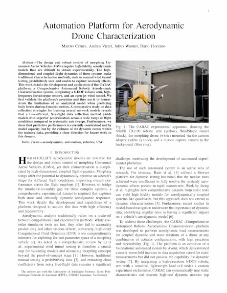

<div align="center">
  <br />
  
  <br />
  <br />
  <br />
</div>

A comprehensive automation platform for conducting aerodynamic experiments on morphing drones under controlled windy conditions. This project was developed as part of a Master's thesis at [École Polytechnique Fédérale de Lausanne (EPFL)](https://www.epfl.ch) by Marcus Cemes (July 2025).

<div align="center">
  <br />
  <a href="./assets/Automation Platform for Aerodynamic Drone Characterization.pdf">
    
    <br />
    <strong>Read the paper »</strong>
  </a>
</div>

## Table of Contents

- [Key Features](#key-features)
- [Architecture](#architecture)
  - [Server (Rust Backend)](#server-rust-backend)
  - [Client (Python Frontend)](#client-python-frontend)
- [Hardware Support](#hardware-support)
  - [Primary Hardware](#primary-hardware)
  - [Custom UDP Devices](#custom-udp-devices)
- [Getting Started](#getting-started)
  - [Prerequisites](#prerequisites)
  - [Installation](#installation)
  - [Configuration](#configuration)
- [Usage](#usage)
  - [1. Running the Server](#1-running-the-server)
  - [2. Running Experiments](#2-running-experiments)
  - [3. Processing Data](#3-processing-data)
  - [4. Training Models](#4-training-models)
- [Command-Line Tools](#command-line-tools)
  - [`carac` (Server & Measurement)](#carac-server--measurement)
  - [`carac-kit` (Data Utilities)](#carac-kit-data-utilities)
- [Client Library (`carac` package)](#client-library-carac-package)
  - [Orchestrator](#orchestrator)
  - [Instructions](#instructions)
  - [Example Experiment Script](#example-experiment-script)
- [Data Format & Session Structure](#data-format--session-structure)
- [Project Structure](#project-structure)

## Key Features

- **Client-Server Architecture**: Robust Rust-based server for hardware control and a flexible Python client for experiment scripting and analysis.
- **Multi-Hardware Integration**: Seamlessly connects and controls diverse hardware systems (Robot Arm, Load Cell, Wind Tunnel, Motion Capture).
- **Experiment Orchestration**: Automated experiment execution with precise timing and coordination via a simple HTTP API.
- **High-Performance Data Collection**: Real-time data streaming and buffering from multiple sources into a custom, high-efficiency binary format.
- **Comprehensive Python Toolkit**:
  - **SDK**: Easy-to-use `async` Python interface for experiment design.
  - **Pipelines**: Tools for post-processing, applying analytical models, and force correction.
  - **Analysis**: Modules for report generation and machine learning.
- **CLI Tools**: Dedicated utilities for serving, data export (CSV/Parquet), file inspection, and payload measurement.
- **Real-time Visualization**: PlotJuggler integration for live data monitoring.

## Architecture

Project CARAC is split into two main components: a Rust server and a Python client.

### Server (Rust Backend)

The server is the central hub that runs on a dedicated machine connected to the hardware. Built on the [Tokio](https://tokio.rs/) asynchronous runtime in Rust, it provides deterministic, high-performance control and data acquisition without the overhead of a garbage collector.

- **Orchestration Engine**: The core of the server, it receives a sequence of `Instruction`s from the client and executes them in order. It manages the overall state of the experiment.
- **Hardware Abstraction**: Each piece of hardware is managed by a dedicated, asynchronous `HardwareAgent`. This modular design allows for concurrent operation and easy extension.
- **DataSink System**: A central component for data collection. Each hardware agent registers data `Stream`s (e.g., `load_cell`, `robot_arm`) and receives a `StreamWriter` handle. This allows agents to write timestamped data to dedicated, non-blocking memory buffers. The system uses a two-level locking strategy to ensure high-throughput, concurrent writes without data loss.
- **Custom UDP Protocols**: Communication with the Stäubli Robot Arm and other custom hardware is handled through efficient, custom binary UDP protocols.
- **HTTP API**: A simple HTTP server built with [Axum](https://github.com/tokio-rs/axum) exposes control endpoints for the Python client.

### Client (Python Frontend)

The client is a collection of Python packages used to interact with the server and process the resulting data.

- **`carac`**: An SDK providing an `Orchestrator` client to communicate with the server's HTTP API. It includes definitions, helpers, and constants for scripting experiments.
- **`experiments`**: A set of runnable Python modules that define specific experimental procedures (e.g., `python -m experiments.free_flight`).
- **`pipeline`**: Scripts for post-processing recorded data, such as applying force corrections, filtering, and running analytical models.
- **`report`**: Code for generating plots, figures, and summaries from processed data.
- **`training`**: A PyTorch-based framework for training machine learning models (MLP, LSTM) on the collected datasets.

## Hardware Support

### Primary Hardware

- **Stäubli TX2-90 Robot Arm**: 6-DOF industrial robot for precise drone positioning. Requires the `RemoteControl` VAL3 program to be loaded onto the CS9 controller.
- **ATI NANO25-E Load Cell**: High-precision force/torque sensor for aerodynamic measurements.
- **WindShape Wind Generator**: Controlled wind generation system.
- **OptiTrack Motion Capture**: Sub-millimetre precision tracking for position and orientation.

### Custom UDP Devices

The platform is designed to be extensible and can support any custom hardware that communicates over UDP.

#### Designing a UDP Device

A custom device must implement a UDP server that listens for commands from the CARAC server. The protocol is a simple binary format:

- **Packet Format**: `[MAGIC_BYTE (0xDE), CHANNEL_COUNT (u8), PAYLOAD (N * f32)]`
- The `PAYLOAD` consists of `CHANNEL_COUNT` floating-point values, sent in little-endian byte order.

The device can also send data back to the CARAC server using the same format. The server will listen for these packets and record them into the corresponding data stream.

#### Drone Relay Example

The `support/drone_relay` directory provides an example of a Python-based UDP relay. It acts as a bridge between the CARAC server and a device with a different communication protocol (in this case, a drone's flight controller). It receives the standard CARAC `Device` instruction, translates the float values into the ASCII format expected by the drone, and forwards the message. This is a useful pattern for integrating off-the-shelf hardware.

## Getting Started

### Prerequisites

- Rust (latest stable version)
- Python 3.10+
- **Stäubli Robotics Suite**: Required to load the VAL3 program onto the robot controller.
- All hardware systems configured and connected to the network.

### Installation

#### 1. Robot Arm Controller Setup

The `support/remote-control` directory contains a **VAL3 project** that must be loaded onto the Stäubli CS9 robot controller. Use the Stäubli Robotics Suite to transfer and run the `RemoteControl` application. This program runs the UDP server on the controller that listens for commands from the CARAC server.

#### 2. Server Installation (Rust)

The server provides two binaries: `carac` for orchestration and `carac-kit` for utilities.

```bash
cd server

# Build the binaries
cargo build --release
```

The binaries will be available in `server/target/release/`.

#### 3. Client Installation (Python)

The client is structured as a Python project with multiple packages.

```bash
cd client

# Create and activate a virtual environment
python -m venv .venv
./.venv/bin/activate

# On Windows, use:
# .\.venv\Scripts\activate

# Install the project in editable mode with all dependencies
pip install -e .
```

### Configuration

The server is configured using a `config.yaml` file. The server loads this file on startup from the current working directory, or from a path specified with the `--config` flag.

```yaml
# Main hardware configuration block
hardware:
  # Stäubli TX2-90 Robot Arm settings
  robot_arm:
    ip: "192.168.1.100" # IP address of the robot controller
    port: 20000          # Port for the robot controller

  # ATI Nano25-E Load Cell settings
  load_cell:
    ip: "192.168.1.101" # IP address of the Net F/T box
    configure_device: true # Whether to apply standard configuration on startup
    buffered_streaming: true # Use buffered streaming for higher data rates

  # OptiTrack Motion Capture settings
  motion_capture:
    ip: "192.168.1.102" # IP of the machine running Motive
    multicast_ip: "239.255.42.99" # Multicast address for data streaming
    rigid_bodies: ["drone"] # List of rigid body names to track

  # WindShape Wind Generator settings
  wind_shape:
    ip: "192.168.1.103" # IP address of the WindShape controller

  # Configuration for additional generic UDP devices
  additional_devices:
    - name: "drone" # Unique name for the device
      ip: "192.168.1.200" # IP address of the device
      port: 21000 # Port for the device
      channels: ["throttle", "sweep_l", "sweep_r", "servo_1", "servo_2"]

# Data sink configuration
sink:
  session_path: "."/data"
  # Optional: Enable real-time data broadcasting to PlotJuggler
  plot_juggler:
    ip: "127.0.0.1"
    port: 9870
```

## Usage

### 1. Running the Server

Start the orchestration server from the `server` directory.

```bash
# From the server directory
./target/release/carac --config path/to/config.yaml
```

The server will initialize all hardware specified in the configuration file and wait for commands from a client.

### 2. Running Experiments

Experiments are defined as Python scripts in `client/src/experiments`. They can be executed as Python modules from the `client` directory.

```bash
# From the client directory
python -m experiments.free_flight
```

### 3. Processing Data

The `pipeline` package processes the raw binary data into analysis-ready Parquet files. It applies corrections, computes derived quantities (e.g., aerodynamic forces), and runs analytical models.

```bash
# From the client directory
python -m pipeline
```

The pipeline's behavior is configured in `client/src/pipeline/config.py`. Processed data is saved to `data/processed`.

### 4. Training Models

The `training` package provides a framework for training ML models on the processed data.

```bash
# From the client directory
python -m training
```

This will load the datasets, define the neural networks (MLP, LSTM), and start training. Models and logs are saved to `data/checkpoints`. Network architectures and training parameters are configured in `client/src/training/defs.py`.

## Command-Line Tools

### `carac` (Server & Measurement)

- `carac server --config <path>`: (Default) Starts the orchestration server.
- `carac measure --config <path>`: Initiates a guided procedure to measure the mass and center of mass of an attached payload.

### `carac-kit` (Data Utilities)

- `carac-kit export --format <csv|parquet> <session_path>`: Exports a session's data.
- `carac-kit view <experiment_path>`: Inspects the header and stream information of a binary recording file.
- `carac-kit plot <session_path>`: Generates plots for all streams and channels in a session.
- `carac-kit extract <experiment_path> --stream <name>`: Extracts data from a specific stream.

## Client Library (`carac` package)

The `carac` Python package is the SDK for interacting with the server.

### Orchestrator

The `carac.orchestrator.Orchestrator` class is the main entry point for client-side scripting. It provides an `async` context manager to handle the connection to the server's HTTP API.

### Instructions

All actions are defined as `Instruction` objects, which are sent to the server in a list and executed sequentially.

- **`Robot(Move(Motion))`**: Commands the robot arm to perform a move (Linear, Direct, Joint, Circular).
- **`Robot(SetProfile(Profile))`**: Sets the robot's speed and acceleration profile.
- **`Wind(SetFanSpeed(speed))`**: Sets the wind tunnel fan speed (0.0 to 1.0).
- **`Device(name, [values])`**: Sends a command to a generic UDP device.
- **`Load(SetBias())`**: Tares the load cell.
- **`Sleep(duration_s)`**: Pauses execution for a specified duration.
- **`Reset()`**: Clears all hardware errors.

### Example Experiment Script

```python
# From an experiment script in client/src/experiments/
from carac.prelude import *
from asyncio import run

WORK_POINT = Points.DroneBase.add(Point(x=500))

async def main():
    async with Orchestrator() as o:
        # 1. Initialize hardware
        await o.execute([
            Reset(),
            Robot(SetProfile(Profiles.Medium)),
            Robot(SetToolOffset(Offsets.Drone)),
            Robot(Move(MotionLinear(WORK_POINT))),
            Robot(WaitSettled()),
            Wind(SetPowered(True)),
        ])

        # 2. Run experimental procedure
        await o.new_experiment("my_pitch_sweep")
        await o.execute([Load(SetBias())])

        await o.record([
            Wind(SetFanSpeed(0.5)),
            Wind(WaitSettled()),
            Robot(Move(MotionLinear(WORK_POINT.add(Point(rx=20))))), # Pitch up
            Robot(WaitSettled()),
            Sleep(1.0),
            Robot(Move(MotionLinear(WORK_POINT.add(Point(rx=-20))))), # Pitch down
            Robot(WaitSettled()),
        ])

        await o.save_experiment()

        # 3. Return to safe state
        await o.execute([
            Wind(SetFanSpeed(0.0)),
            Robot(ReturnHome()),
        ])

if __name__ == "__main__":
    run(main())
```

## Data Format & Session Structure

- **Session Directory**: Contains all recordings for an experiment.
- **`meta.json`**: A top-level file defining all data streams and their channels (e.g., `load/fx`, `robot/x`).
- **Binary Files**: Each recording is saved to a custom binary format optimized for high-frequency time-series data.

## Project Structure

```
project-carac/
├── client/
│   ├── src/
│   │   ├── carac/          # Core Python SDK
│   │   ├── experiments/    # Runnable experiment scripts
│   │   ├── pipeline/       # Data processing and correction scripts
│   │   ├── report/         # Plotting and report generation
│   │   └── training/       # Machine learning models
│   └── pyproject.toml
│
├── server/
│   ├── src/
│   │   ├── bin/            # Entrypoints for `carac` and `carac-kit`
│   │   ├── cli/            # Command-line interface logic
│   │   ├── config.rs       # Configuration structures
│   │   ├── data/           # Data handling, Orchestrator logic
│   │   └── hardware/       # Hardware abstraction layer
│   └── Cargo.toml
│
└── support/
    ├── drone_relay/        # Example UDP relay for custom devices
    └── remote-control/     # Stäubli VAL3 robot controller program
```
